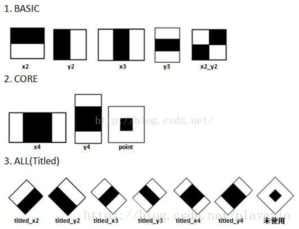
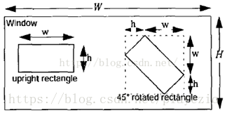
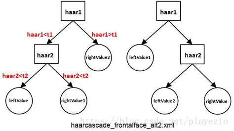
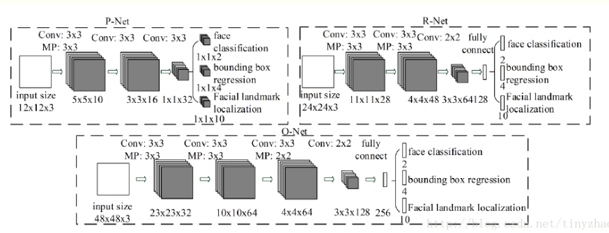
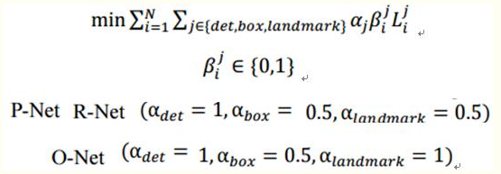
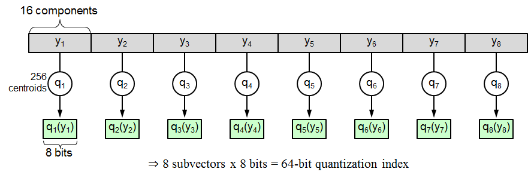

# facetrain
基于人脸检测、人脸识别、人脸检索的类门禁系统

**人脸识别系统**

一.  背景

>   感兴趣，相对比较空闲，也有一些应用空间，所以做一做。

二.  目的

>   对人脸识别相关技术进行实际运用，并以完整项目的形式去探索实际应用中存在的问题和差异，让技术不仅仅存在于实验，也能够应用于实际的场景当中。

三.  项目结构

>   从前端进行注册和认证，前端检测到人脸后采集图片并发送给后端，对图片再次进行人脸检测，对检测到的人脸进行特征化，对特征向量进行编码，然后检索数据库进行比较。

>   流程说明:

四.  人脸检测

>   4.1 基于Adaboost算法的人脸检测

>   Haar以特征模板的形式对图片加工处理，计算得到Haar特征，使用Adaboost算法建立联级分类器。

>   4.1.1 Haar 特征

>   Haar特征最先由Paul
>   Viola等提出，包括边缘特征、线性特征、中心特征和对角线特征，后经过RainerLienhart等扩展引入45°倾斜特征，组合成特征模板。目前OpenCV所使用的共计14种Haar特征，包括5种Basic特征、3种Core特征和6种Titled(即45°旋转)特征。

>   在实际中，Haar特征在检测窗口中自由放大+平移产生一系列子特征。

>   假设检测窗口大小为W\*H，矩形特征大小为w\*h，X和Y为表示矩形特征在水平和垂直方向的能放大的最大比例系数：

>   在检测窗口Window中，一般矩形特征(upright rectangle)的数量为：

>   特征模板内有白色和黑色两种矩形，并定义该模板的特征值为白色矩形像素和减去黑色矩形像素和，不同的矩形模板黑白权重不一样。实际上相当于在做卷积操作，这些模板类似于能检测不同方向的梯度的卷积核。

>   由于特征较多，计算量较大，因此使用积分图的方法可大大减少计算量。同时，使用AdaBoost对Haar特征进行训练建模。

>   4.1.2 AdaBoost联级分类器

>   OpenCV中的AdaBoost级联分类是树状结构，其中每一个stage都代表一个强分类器。当检测窗口通过所有的强分类器时才被认为是目标，否则拒绝。实际上，不仅强分类器是树状结构，强分类器中的每一个弱分类器也是树状结构。

>   一个完整的弱分类器包含：Haar特征+ leftValue + rightValue +
>   弱分类器阈值(threshold)，这些元素共同构成了弱分类器。

>   在OpenCV中，强分类器是由多个弱分类器“并列”构成，即强分类器中的弱分类器是两两相互独立的。在检测目标时，每个弱分类器独立运行并输出值，然后把当前强分类器中每一个弱分类器的输出值相加。

>   所以，这里的AdaBoost联级分类器实际是
>   由弱分类器“并联”组成强分类器，而由强分类器“串联”组成级联分类器。

>   4.2 基于深度学习的算法MTCNN

>   MTCNN利用检测和校准之间固有的相关性在深度级联的多任务框架下来提升检测的性能。利用人脸检测、边框检测、特征点检测3个任务来提高检测准确度，同时使用3个联级网络依次筛选出候选位置，减少了联级网络的计算量，实现训练速度上的提升。

>   网络结构：

>   将图片缩放到不同尺度形成图像金字塔，以达到尺度不变。

>   1、使用P-Net是一个全卷积网络，用来生成候选窗和边框回归向量(bounding box
>   regression vectors)。使用Bounding box
>   regression的方法来校正这些候选窗，使用非极大值抑制（NMS）合并重叠的候选框。

>   2、使用N-Net改善候选窗。将通过P-Net的候选窗输入R-Net中，拒绝掉大部分false的窗口，继续使用Bounding
>   box regression和NMS合并。

>   3、最后使用O-Net输出最终的人脸框和特征点位置。

>   这个算法需要实现三个任务的学习：人脸非人脸的分类，bounding box
>   regression和人脸特征点定位MTCNN特征描述子主要包含3个部分，人脸/非人脸分类器，边界框回归，地标定位。

>   人脸分类：

>   上式为人脸分类的交叉熵损失函数，其中，pi为是人脸的概率，yidet为背景的真实标签。

>   边界框回归：

>   上式为通过欧氏距离计算的回归损失。其中，y为一个（左上角x，左上角y，长，宽）组成的四元组。

>   地标定位：

>   上式为通过欧氏距离计算的回归损失。由于一共5个点，每个点2个坐标，所以，y属于十元组。

>   模型的损失函数：

>   整个的训练学习过程就是最小化上面的这个函数，其中，N为训练样本数量，a表示每层网络的任务的权重。

五.  人脸特征

检测到人脸后，对人脸进行识别，但这里并不通过模型进行直接识别，而是以向量的形式进行相似度计算。所以需要对人脸进行特征向量化。具体方式为深度学习的人脸识别模型为基础，去除最后一层输出层，以向量的形式保存数据。这里使用是由dlib开源的一个基于Resnet的29层的网络。

六.  人脸检索

将人脸转换成特征向量后，需要在已有的人脸特征向量库里寻找最相似的特征向量，为了更快速的找到目标，使用高维向量检索技术，将大幅度的减少检索对比次数，实现快速检索响应。

6.1 ProductQuantization

>   PQ先将D维空间切分成M份：即将128维空间切分成M个D/M维的子空间。

>   在每个子空间内分别进行聚类，原始变量就可以压缩成由M个索引值构成的压缩向量。

6.2 距离计算

>   对称距离计算：提前计算好压缩向量之间的距离，检索时直接根据索引进行查找最相近的压缩向量。

>   非对称距离计算：提前抽离出各个子区间的聚类中心点，检索时直接与有限的中心点进行比较，找出最相似的压缩向量。

七.  实验

>   7.1 获取数据

>   通过爬虫从网上获取了16143张明星图片，对图片进行人脸检测，去除未检测到人脸和多人脸的图片。对同一人的人脸特征向量相似度进行比较，去除相似度差异较大的特征向量。最终筛选出5611张，255位明星的有效的特征向量，将这些特征入库，用于模拟人脸数据库。

>   7.2 注册阶段

>   通过前端采集图片返回的后端，对图片进行人脸检测，检测到之后对人脸进行特征化，对特征向量的相似度进行比较，若满足相似度在阈值内，则认为图片有效。对特征向量进行编码，入库。

>   7.3 认证阶段

>   前端检测到人脸后，采集图片返回到后端，对人脸进行特征化，对特征向量进行编码，在数据库中进行检索，在候选集中进行相似度比对。根据规则加模型的方式对人脸是否存在于数据库进行判定，根据最高相似度对人脸进行识别认证。

>   7.4 实验结果
